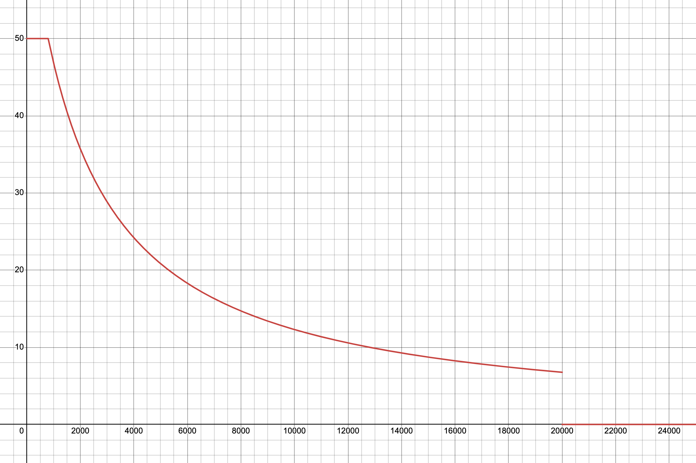

## 採点方法

1. [Lighthouse](https://github.com/GoogleChrome/lighthouse) を用いて、次の2つを検査します
   - ページの表示（900点満点）
   - ページの操作（200点満点）
   - 動画の再生（100点満点）
2. 検査したそれぞれのスコアを合算し、得点とします（1200点満点）

ただし，採点にあたっては以下のルールで実施します

- 採点を高速化するため、 **「ページの表示」で200点以上獲得した場合にのみ「ページの操作」「動画の再生」の採点を行います**
  - 採点対象外となった項目は0点として計算されます
- 採点結果は随時リーダーボードに表示されますが、 **競技終了後のレギュレーションチェックにて違反が発見された場合、最終順位からは除外され、対象外となります**

### ページの表示

1. [Lighthouse](https://github.com/GoogleChrome/lighthouse) を用いて、次の9つのページを検査します
   - ホーム
   - 番組表
   - 番組
     - 放送前
     - 放送中
     - 放送後
   - シリーズ
   - エピソード
     - 無料
     - プレミアム
   - 404
2. [Lighthouse v10 Performance Scoring](https://developer.chrome.com/docs/lighthouse/performance/performance-scoring#lighthouse-10) に基づき、次の総和をページのスコアとします
   - First Contentful Paint のスコア × 10 (0-10 点)
   - Speed Index のスコア × 10 (0-10 点)
   - Largest Contentful Paint のスコア × 25 (0-25 点)
   - Total Blocking Time のスコア × 30 (0-30 点)
   - Cumulative Layout Shift のスコア × 25 (0-25 点)
3. 各ページのスコアを合算し、「ページの表示」の得点とします (900点満点)

### ページの操作

1. [Lighthouse](https://github.com/GoogleChrome/lighthouse) を用いて、次の4つのシナリオを検査します
   - ユーザーの認証
     - ユーザー作成 → ログアウト → ログイン
   - 番組表の操作
     - カラムの拡大・縮小
   - サービス内回遊
     - ホーム → シリーズ → エピソード
     - 番組表 → 番組詳細モーダル → 番組 → 関連エピソード
2. 次の総和をシナリオのスコアとします
   - Total Blocking Time のスコア × 25 (0-25 点)
   - Interaction to Next Paint のスコア × 25 (0-25 点)
3. 各シナリオのスコアを合算し、「ページの操作」の得点とします（200点満点）

### 動画の再生

1. [Puppeteer](https://pptr.dev/) を用いて、次の2つのシナリオを検査します
   - エピソードの動画視聴
   - 番組の動画視聴
2. 次の計算式で算出される数値をシナリオのスコアとします (0-50点)

ランディング開始から動画が再生されるまで ([time origin](https://developer.mozilla.org/en-US/docs/Web/API/Performance/timeOrigin) から初回の [playing イベント](https://developer.mozilla.org/en-US/docs/Web/API/HTMLMediaElement/playing_event)が発火するまで) の時間を $t[ms]$ として

$$
t_{mod} = max(0, t - 800)
$$

$$
score_{vanilla} = 1 - \frac{t_{mod}}{t_{mod} + 3000}
$$

$$
score = score_{vanilla} \times 50
$$

ただし、 $t \geqq 20000$ の場合は0点となります。

横軸を $t$, 縦軸を $score$ としたときのグラフは以下のとおりです。

([グラフの元データ](https://www.desmos.com/calculator/hhmbjhxlhp)から詳細を確認できます)

3. 各シナリオのスコアを合算し、「動画の再生」の得点とします（100点満点）
